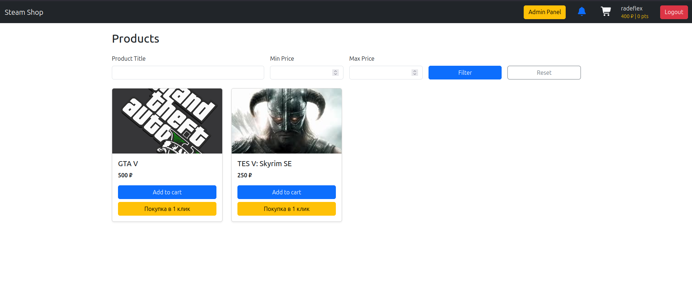
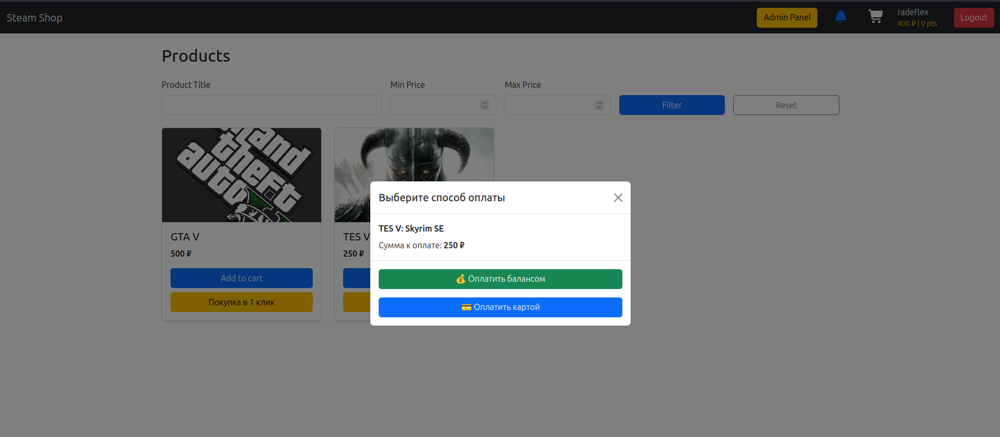
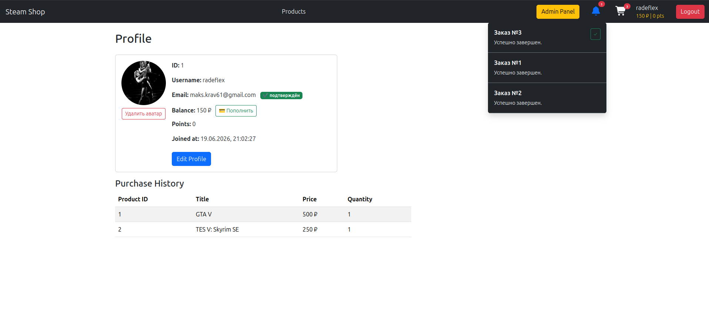
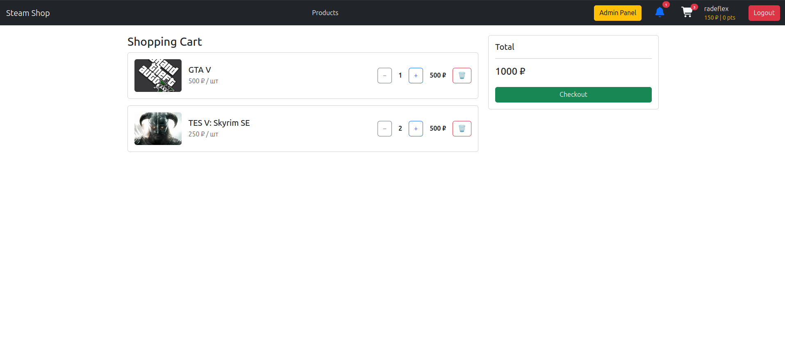
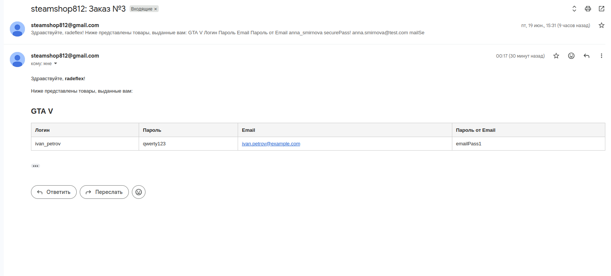
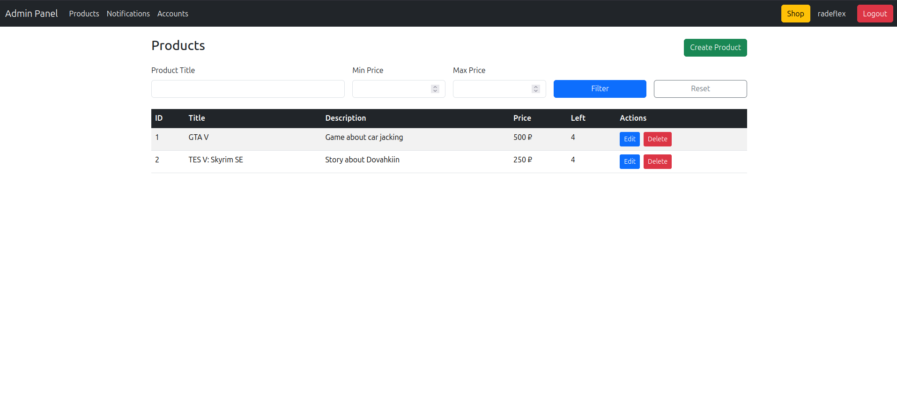
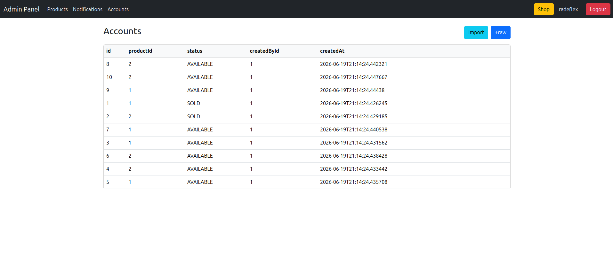
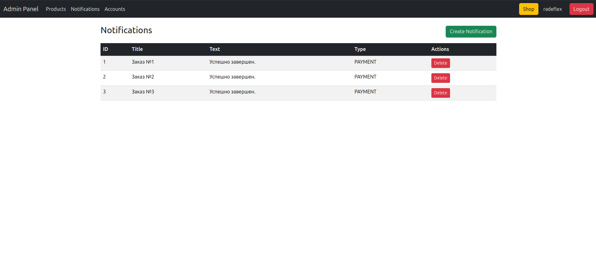

# 🎮 Steam Shop

A fullstack web application for buying and selling Steam accounts — with a user storefront, shopping cart, payment system, admin panel, and email confirmation flow.


---

## 📋 Table of Contents

- [About](#about)
- [Features](#features)
- [Tech Stack](#tech-stack)
- [Screenshots](#screenshots)
- [Architecture](#architecture)
- [Getting Started](#getting-started)

---

## About

Steam Shop is a fullstack e-commerce platform for purchasing Steam accounts. It features JWT-based authentication with email confirmation, a shopping cart and payment flow, a purchase history tracker, an admin dashboard, and a notification system.

---

## Features

### 👤 User
- Register and login with **email confirmation**
- Browse available Steam accounts (products) with images
- Add items to **shopping cart** and checkout
- Full **payment flow via [Yookassa](https://yoomoney.ru)** with status tracking
- View purchase history
- View and edit personal profile

### 🛠️ Admin Panel
- Manage products (create, edit, delete) with image upload
- Manage Steam account inventory (`AccountStatus` tracking)
- View and manage all registered users
- Create and send typed **notifications** to users (with read tracking)

### 🔐 Security
- **JWT authentication** (`JwtService` + filter chain)
- Role-based access control (`UserRole`: USER / ADMIN)
- Email confirmation tokens (`EmailConfirmation` entity)

---

## Tech Stack

### Backend
- **Java + Spring Boot** — REST API
- **Spring Security + JWT** — authentication & authorization
- **Spring Data JPA** — data access layer (repositories)
- **Spring Data Redis** — data caching
- **MailService** — email sending (confirmation, notifications)
- **Maven** — build tool

### Frontend
- **React** (Create React App) — SPA
- **Context API** — global auth & cart state
- **Nginx** — production static file serving

### DevOps
- **Docker + Docker Compose** — containerization
- **GitHub Actions** — CI/CD pipeline

---

## Screenshots





### Admin panel




## Architecture

The backend follows a clean layered architecture:

```
Controller → Service → Repository → Database
```

| Layer | Responsibility |
|---|---|
| `http/controller` | REST endpoints, request/response handling |
| `http/filter` | JWT filter, request preprocessing |
| `http/handler` | Exception & error handling |
| `service` | Business logic |
| `repository` | JPA data access |
| `entity` | JPA domain models |
| `dto` | Data transfer objects |
| `mapper` | Entity ↔ DTO conversion |
| `configuration` | Spring Security, beans config |
| `props` | Typed config properties |
| `utils` | Utility helpers |

---

## Getting Started

### Prerequisites

- [Docker](https://www.docker.com/) & Docker Compose
- [Java 17+](https://adoptium.net/) *(for local backend dev)*
- [Node.js 18+](https://nodejs.org/) *(for local frontend dev)*
- Localhost tunneling for Yookassa ([Ngrok](https://nodejs.org/) or [Cloudpub](https://cloudpub.ru) in Russia)

### Typical .env configuration

```bash
# SMTP mailing creds
MAIL_HOST=smtp.gmail.com
MAIL_PORT=587
MAIL_USERNAME=steamshop@gmail.com
MAIL_PASSWORD=xxxxxxxxxxxxxxxxxx

# Postgres creds
DB_NAME=steamsh
DB_USERNAME=postgres
DB_PASSWORD=123123

# S3
S3_BUCKET=bucket
S3_ENDPOINT=https://s3.storage.selcloud.ru
S3_REGION=ru-1
S3_ACCESS=xxxxxxxxxxxxxxxxxxxxxxxxxxxxx
S3_SECRET=xxxxxxxxxxxxxxxxxxxxxxxxxxxxx

JWT_SECRET=veryverystrongjwtsecretatleast36chars

# Yookassa api creds
SHOP_ID=12345678
SHOP_TOKEN=test_xxxxxxxxxxxxxxxxxxxxxx

UI_URL=https://example.com/ # frontend domain
```

### Run with Docker

```bash
git clone https://github.com/radeflex/steam-shop.git
cd steam-shop
docker compose up
```

- **Frontend** → http://localhost:3000
- **Backend API** → http://localhost:8443
- **Swagger-ui** → http://localhost:8443/swagger-ui/index.html

```bash
docker compose down   # to stop
```

### Admin rights
You can give admin rights to account manually via Docker:
```bash
docker exec -it postgres-stsh psql --dbname steamsh -U postgres
SELECT * FROM users;
UPDATE users SET role = 'ADMIN' WHERE id = 1; # re-login after this
```

### Run Locally

**Backend:**
```bash
cd backend
./mvnw spring-boot:run
```

**Frontend:**
```bash
cd frontend
npm install
npm start
```

---

## Author

Made by [@radeflex](https://github.com/radeflex)
